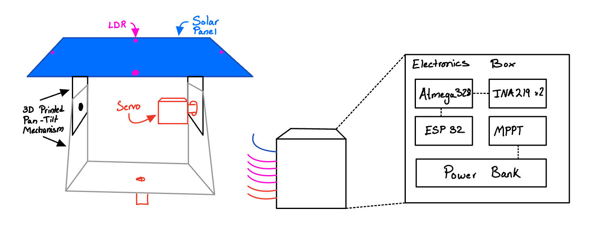
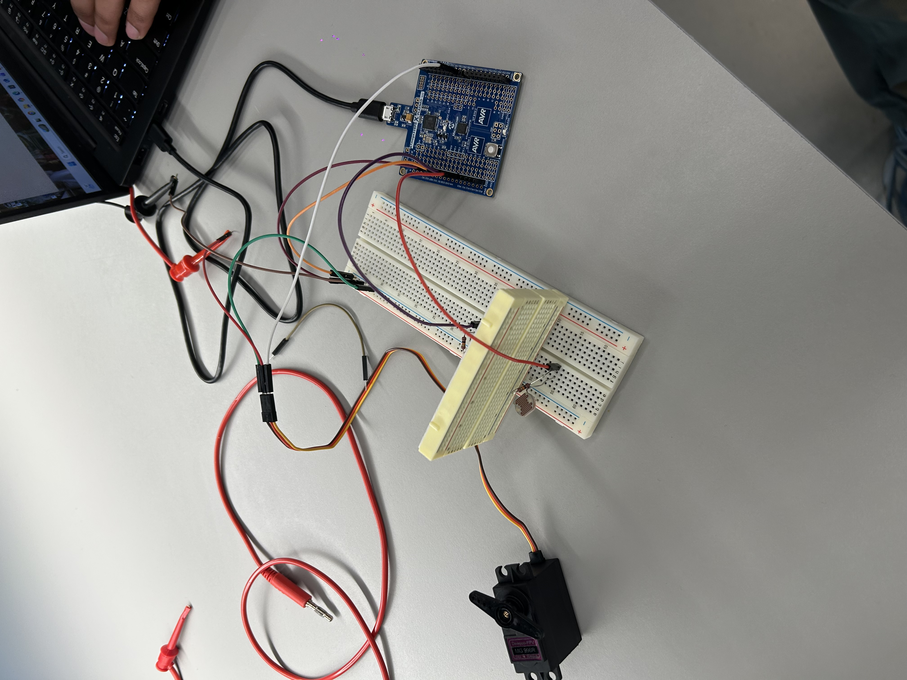
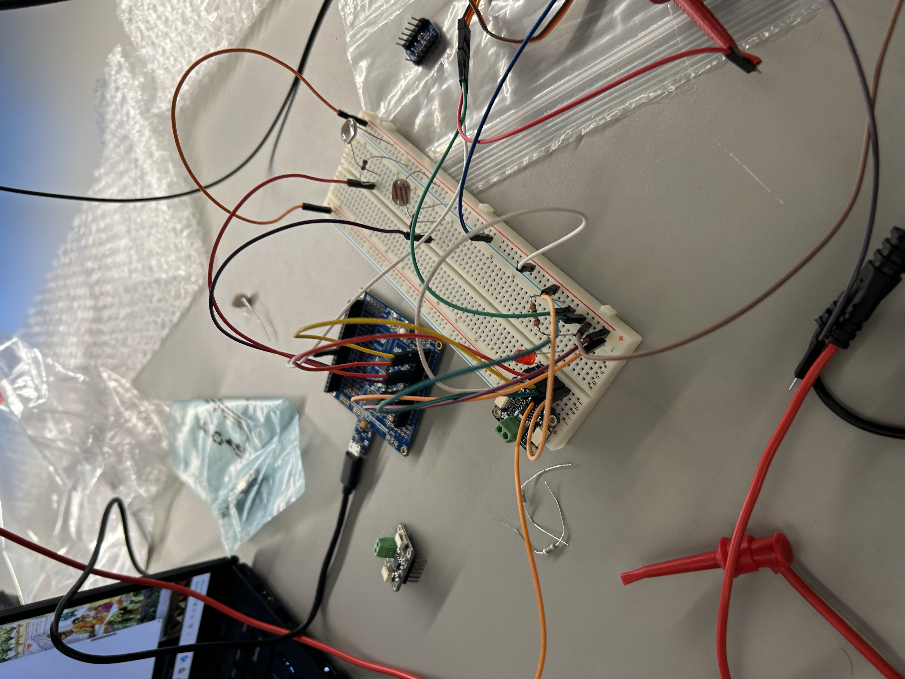
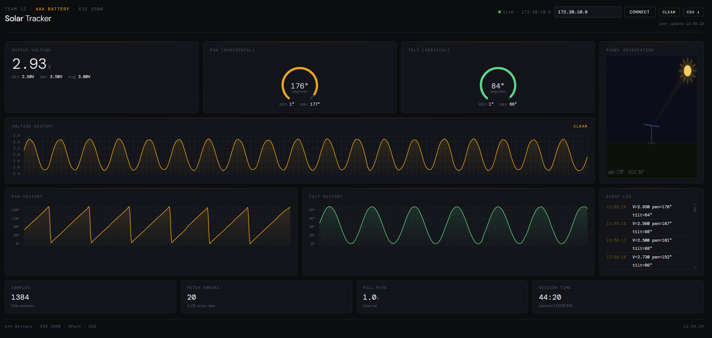
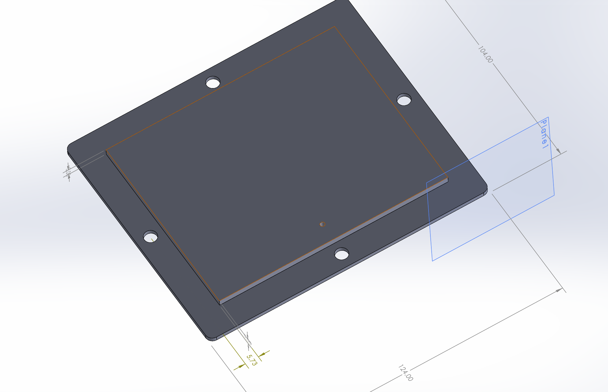
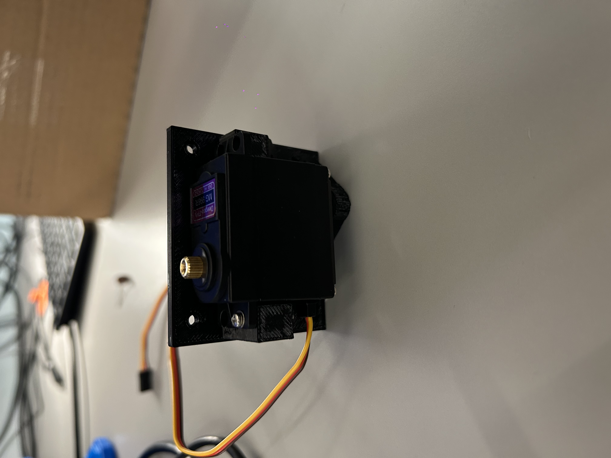
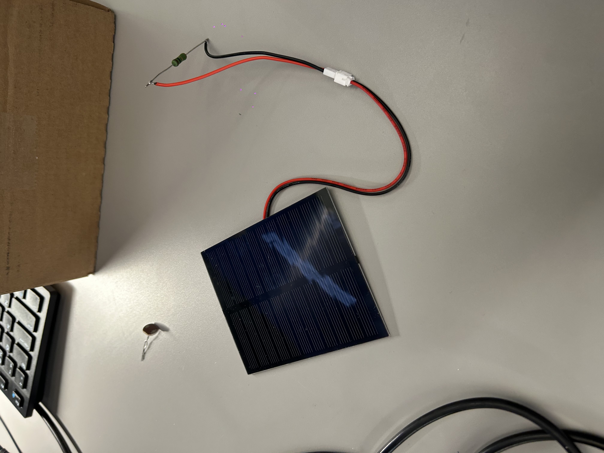

# Final Project

**Team Number:** Team 12

**Team Name:** AAA Battery

| Team Member Name | Email Address          |
| ---------------- | ---------------------- |
| Abhay Agarwal    | abhaya@seas.upenn.edu  |
| Ashwin Ranjan    | aranjan@seas.upenn.edu |
| Arnuv Batra      | avbatra@seas.upenn.edu |

**GitHub Repository URL:** https://github.com/upenn-embedded/final-project-s26-t26.git

**GitHub Pages Website URL:** [for final submission]*

## Final Project Proposal

### 1. Abstract

Our project is a dual-axis solar tracker that automatically orients a solar panel toward the brightest light source and maximizes the energy harvested from it. Four light sensors detect the sun's direction, two servos aim the panel, and an MPPT algorithm tunes a buck converter to extract peak power. An ESP32 streams data to a live web dashboard. The system demonstrates measurable efficiency gains over a fixed panel.

### 2. Motivation

Fixed solar panels lose significant energy throughout the day as the sun moves across the sky - often capturing only 60–70% of available energy compared to a panel that tracks the sun. Adding MPPT further increases efficiency by ensuring the panel operates at optimal voltage regardless of changing light and temperature conditions.

This project is interesting as it will combine analog sensing, real-time control, power electronics, and IoT on the ATMega. The result is a fully functional miniature solar energy system that is optimized to maximize power output.

### 3. System Block Diagram

### 4. Design Sketches

The LDR quadrant divider is the most critical design feature — a small cross-shaped wall between the four LDRs that creates shadow differences when the panel is off-angle, enabling the tracking algorithm to determine direction.
The pan-tilt bracket and base enclosure will both be 3D-printed, allowing us to customize the mount to fit our specific solar panel and servo arrangement.

### 5. Software Requirements Specification (SRS)

**5.1 Definitions, Abbreviations**

Here, you will define any special terms, acronyms, or abbreviations you plan to use for hardware

LDR = light dependent resistor

MPPT = Maximum Power Point Tracking (for solar panels, basically constantl adjusting to optimize the voltage/current delivered for maximum power output)

**5.2 Functionality**

| ID     | Description                                                                                                                                                                                                                         |
| ------ | ----------------------------------------------------------------------------------------------------------------------------------------------------------------------------------------------------------------------------------- |
| SRS-01 | The system will sample the 4 LDRs via the ADC at a minimum frequency of 10 Hz.                                                                                                                                                      |
| SRS-02 | The firmware will implement a deadband filter algorithm to prevent servo jitter when the calculated light intensity error between opposing LDRs is below a certain threshold.                                                       |
| SRS-03 | The system will update the IoT dashboard without major latency (<3 seconds) with current tracking status, MPPT values, and error margins. This will be achieved with a ESP32 coprocessor acting solely as a serial-to-Wi-Fi bridge. |
| SRS-04 | The MCU will utilize hardware timers to generate a stable 50Hz PWM signal for servo actuation without blocking the main execution loop.                                                                                             |
| SRS-05 | Upon a physical button press interrupt, the system will reset the servos to a default home position within 2 seconds.                                                                                                               |

### 6. Hardware Requirements Specification (HRS)

**6.1 Definitions, Abbreviations**

Here, you will define any special terms, acronyms, or abbreviations you plan to use for hardware

**6.2 Functionality**

| ID     | Description                                                                                                                                                                                             |
| ------ | ------------------------------------------------------------------------------------------------------------------------------------------------------------------------------------------------------- |
| HRS-01 | The solar tracking mechanism will physically rotate at least 45 degrees horizontally (pan) and 45 degrees vertically (tilt).                                                                            |
| HRS-02 | The LDRs accurately capture the difference in light between specific locations on the panel, which is then used to adjust the panel tilt and pan accordingly.                                           |
| HRS-03 | An off-the-shelf MPPT module OR our own custom hardware using a buck/boost converter + PWM from the ATMega will safely regulate the charging voltage from the solar panel to the energy storage system. |
| HRS-04 | The system should charge a battery bank via USB-C, and be able to clearly show whether power is being generated via an LED.                                                                             |

### 7. Bill of Materials (BOM)
What major components do you need and why? Try to be as specific as possible.:

We need the 2 processors (ATMega and ESP 32). The ATMega is for general communication and interfacing and will be where our computing is done. The ESP32 serves as a port to serve the data we recieve, after processing, to the cloud via wifi. 

We use 4 LDRs to take brightness readings at each corner, and for each of them we read the current that passes through them as a measure of how bright/dim the area is, so we can angle our solar panel accordingly. 

The solar panel is used to actually capture power, and it's mounted on 2 micro stepper motors to control its pan (horizontal) and tilt (vertical) axes. 

A current/voltage sensor is used to read the output power of the solar panel, and the power bank is used to store the generated electricity. 

The details of all these can be found in the sheet below.

[BOM Sheet](https://docs.google.com/spreadsheets/d/1A1eUAg9dwYdbk0ykns5I-RBsm5lOC9emmNqb9aPvp44/edit?usp=sharing)

### 8. Final Demo Goals

A movable desk lamp will simulate the sun. We move the lamp to different positions and the panel visibly tracks it in real time. A laptop next to the device will display the live web dashboard showing power output and panel orientation.
The main constraints are WiFi access in the lab for the ESP32 dashboard and a power outlet for the desk lamp. The device itself runs on its solar panel and battery.

### 9. Sprint Planning

| Milestone  | Functionality Achieved                                                                                                                                                                                                                                                                                                                                        | Distribution of Work                                                                                                                                                                                                               |
| ---------- | ------------------------------------------------------------------------------------------------------------------------------------------------------------------------------------------------------------------------------------------------------------------------------------------------------------------------------------------------------------- | ---------------------------------------------------------------------------------------------------------------------------------------------------------------------------------------------------------------------------------- |
| Sprint #1  | Finalize BOM, order parts, and begin 3D printing the gimbal/baffle. Set up the bare-metal C toolchain. Write and test the ADC polling and PWM timer code. Connect the servos and test movement.                                                                                                                                                               | Arnuv: BOM finalization, 3D print gimbal/baffle. Abhay: ADC polling & LDR voltage divider setup, toolchain config. Ashwin: PWM timer drivers & servo connection/testing.                                                           |
| Sprint #2  | Implement the LDR-based tracking algorithm with deadband filtering and verify servo response to differential light readings. Begin MPPT module wiring and validate solar panel charging into the battery bank. Set up UART communication between ATmega and ESP32 and confirm serial data passthrough. Start scaffolding the web dashboard on the ESP32 side. | Arnuv: MPPT module wiring, solar panel integration, charging validation. Abhay: UART bridge between ATmega & ESP32, begin ESP32 dashboard scaffolding. Ashwin: Tracking algorithm with deadband filter, servo closed-loop testing. |
| MVP Demo   | Integrate LDR inputs with servo outputs to achieve basic tracking. Wire the MPPT module for basic charging. Integrate the I2C current sensors. Write the UART bridge firmware and establish the ESP32 web dashboard.                                                                                                                                          | Arnuv: I2C INA219 sensor integration, mechanical assembly refinement, home-position button interrupt. Abhay: Live dashboard displaying tracking status & MPPT values. Ashwin: Full tracking loop integration.                      |
| Final Demo | Final hardware integration, code optimization, and rigorous testing for the final demonstration.                                                                                                                                                                                                                                                              | All: End-to-end system testing, debugging, demo prep. Arnuv: Mechanical fit & finish, LED power indicator integration. Abhay: Dashboard polish & latency validation. Ashwin: Tracking accuracy tuning & code cleanup.              |

**This is the end of the Project Proposal section. The remaining sections will be filled out based on the milestone schedule.**

## Sprint Review #1

### Last week's progress

This week we built a simplified single-axis solar tracker demo to validate our core tracking algorithm before integrating into the full dual-axis system. We wrote the code in demo.c and pushed it to the repo.
The demo uses two LDRs connected to PC0 and PC1 to sense light direction. We configured Timer1 to generate 50Hz PWM on PB1 for servo control. The tracking algorithm compares the two LDR readings and moves the servo toward the brighter side. We also implemented a deadband filter to prevent the servo from jittering when the light levels are nearly equal.

During development we ran into a few issues. The board kept resetting whenever the servo moved, which we traced to the servo drawing too much current and causing a voltage drop.

Once we fixed that, we discovered the servo was drifting more in one direction even when the light was centered. This was because our two LDRs have slightly different responses, so we added UART printing to read the raw ADC values. Next time we will calculate a calibration offset to add to our code

### Current state of project

The single-axis tracking demo is working. The servo successfully follows a light source using two LDRs. This validates our tracking algorithm and servo control code, which we can now duplicate for the second axis. The 3D printed gimbal mount is being designed. We have also ordered the needed parts.

### Next week's plan

Abhay will set up the INA219 sensors and ESP32 communication, around 5 hours. Done when sensor data displays on the ESP32.

Ashwin will add the second servo and tune the tracking, around 4 hours. Done when the panel tracks light in both axes smoothly.

Arnuv will 3D print the gimbal mount and LDR divider, around 6 hours. Done when everything is mounted and moves freely.

## Sprint Review #2

### Last week's progress

Abhay completed the INA219 current/voltage sensing setup. The INA219 is now communicating over I2C and providing accurate power readings from the solar panel. The driver code has been written and pushed to the repo.

Ashwin got the ESP32 Feather working and set up a local web server that pulls all sensor data for the live dashboard. He also sent off the prints for the remaining mechanical housing parts.

Arnuv printed the mechanical parts for the gimbal and is assembling the full pan-tilt mechanism with the servos mounted. He also CADed and printed a solar panel mount.

### Current state of project

The core sensing and data pipeline is coming together. The INA219 is reading solar panel power output, the ESP32 is hosting a live dashboard over Wi-Fi, and the mechanical gimbal is being assembled with the 3D-printed parts. The main integration work remaining is connecting the ATmega tracking loop to the ESP32 dashboard via UART and mounting the solar panel on the completed gimbal.

### Next week's plan

Abhay will integrate the INA219 readings into the UART data stream to the ESP32, around 4 hours. Done when live power data appears on the web dashboard.

Ashwin will finalize the full tracking loop integrating both axes with the ESP32 data display, around 5 hours. Done when the dashboard shows real-time tracking status and power output.

Arnuv will complete the mechanical assembly and mount the solar panel and LDR divider onto the gimbal, around 5 hours. Done when the full system is physically assembled and the panel can move freely on both axes.

## MVP Demo

## Final Report

Don't forget to make the GitHub pages public website!
If you’ve never made a GitHub pages website before, you can follow this webpage (though, substitute your final project repository for the GitHub username one in the quickstart guide):  [https://docs.github.com/en/pages/quickstart](https://docs.github.com/en/pages/quickstart)

### 1. Video

### 2. Images

### 3. Results

#### 3.1 Software Requirements Specification (SRS) Results

| ID     | Description                                                                                               | Validation Outcome                                                                          |
| ------ | --------------------------------------------------------------------------------------------------------- | ------------------------------------------------------------------------------------------- |
| SRS-01 | The IMU 3-axis acceleration will be measured with 16-bit depth every 100 milliseconds +/-10 milliseconds. | Confirmed, logged output from the MCU is saved to "validation" folder in GitHub repository. |

#### 3.2 Hardware Requirements Specification (HRS) Results

| ID     | Description                                                                                                                        | Validation Outcome                                                                                                      |
| ------ | ---------------------------------------------------------------------------------------------------------------------------------- | ----------------------------------------------------------------------------------------------------------------------- |
| HRS-01 | A distance sensor shall be used for obstacle detection. The sensor shall detect obstacles at a maximum distance of at least 10 cm. | Confirmed, sensed obstacles up to 15cm. Video in "validation" folder, shows tape measure and logged output to terminal. |
|        |                                                                                                                                    |                                                                                                                         |

### 4. Conclusion

## References
